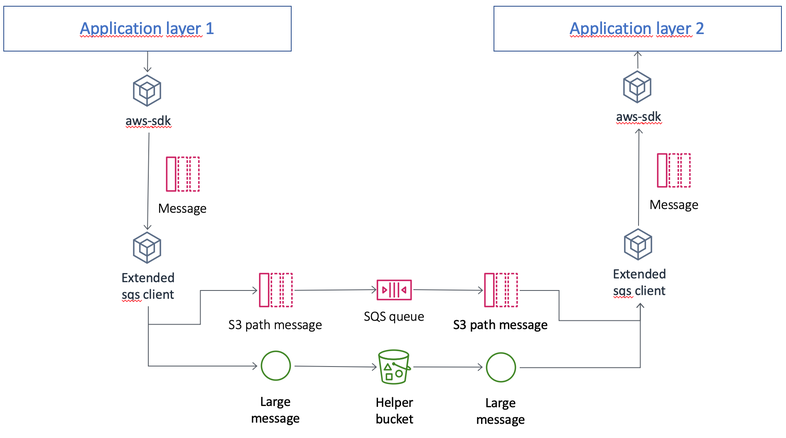

# AWS SQS XL Messages

> Inspired by [amazon-sqs-java-extended-client-lib](https://github.com/awslabs/amazon-sqs-java-extended-client-lib)

The AWS SQS XL Messages Library enables you to manage Amazon SQS message payloads with Amazon S3. This is especially useful for storing and retrieving messages with a message payload size greater than the current SQS limit of 256 KB, up to a maximum of 2 GB. Specifically, you can use this library to:

* Specify whether message payloads are always stored in Amazon S3 or only when a message's size exceeds 256 KB.

* Send a message that references a single message object stored in an Amazon S3 bucket.

* Get the corresponding message object from an Amazon S3 bucket.

* Delete the corresponding message object from an Amazon S3 bucket.

## Overview



## Usage

1. Add [aws-sdk](https://www.npmjs.com/package/aws-sdk) and `aws-sqs-xl-messages` to your dependencies:

    ```sh
    $ npm i aws-sdk aws-sqs-xl-messages
    ```

2. Decorate an SQS client from `aws-sdk` with this library:

    ```js
    const { SQS, S3 } = require("aws-sdk"),
        { SQSExt, Config } = require("aws-sqs-xl-messages")(SQS), // inject the SQS client that will be decorated
        config = new Config();

    config.enableLargePayloadSupport(new S3(), "my-bucket"); // tell the client which S3 bucket to use.

    // optionally tell the client whether it must always upload messages to S3. This defaults to false.
    config.alwaysThroughS3 = false;
    // optionally tell the client whether it must prefix S3 objects with the QueueName. Useful if you
    // plan to use one single bucket for more than one SQS queue. This defaults to true.
    config.addQueueToS3Key = true;

    let sqs = new SQSExt({ extendedConfig: config });

    // you can now use sqs as if it was an sqs client from aws-sdk

    // will send message's body to S3 if it's larger than the threshold (or alwaysThroughS3)
    await sqs.sendMessage(sendParams).promise();

    // will fetch transparently message's body from S3 when needed.
    const response = await sqs.receiveMessages(receiveParams).promise();

    // will delete S3 object (if any) too.
    await sqs.deleteMessage(deleteParams).promise();
    ```

## Limitations

v1.0.0 has a few limitations:

1. Only the following methods are decorated:
    * **sendMessage**

    * **receiveMessage**

    * **deleteMessage**

    * **deleteMessageBatch**

    ---
    **NOTE**

    We plan to extend this list at least with **sendMessageBatch**, **purgeQueue** and **deleteQueue**.

    ---

2. Decoration is done by overwriting [AWS.Request](https://docs.aws.amazon.com/AWSJavaScriptSDK/latest/AWS/Request.html) methods, and some workflows are not yet supported. In particular, promise-like and in-place callbacks will work. However calling to `send` manually won't.

    ```js
    // this works
    await sqs.sendMessage(params).promise();

    // this works
    sqs.sendMessage(params, callback);

    // this doesn't work
    let request = sqs.sendMessage(params);
    request.send(callback);
    ```

3. Lambda integration. When working with AWS Lambda, you don't need to call `receiveMessage` and `deleteMessage` manually. It's managed internally by AWS. That means we can't transparently download nor delete S3 objects. It needs to be done manually inside the lambda function.

    ---
    **NOTE**

    We plan to expose a public API to download S3 objects based on an SQS message in the near future.

    ---